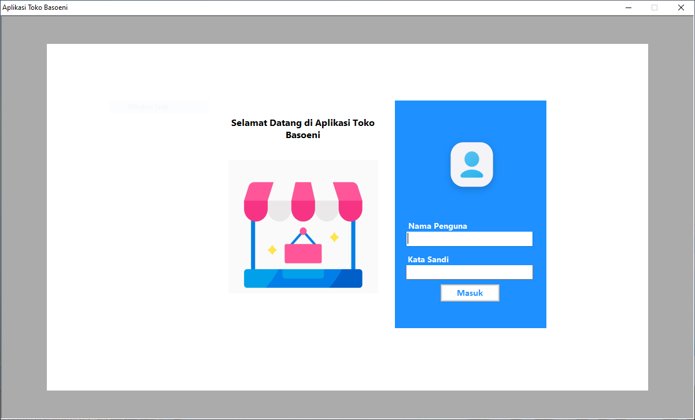
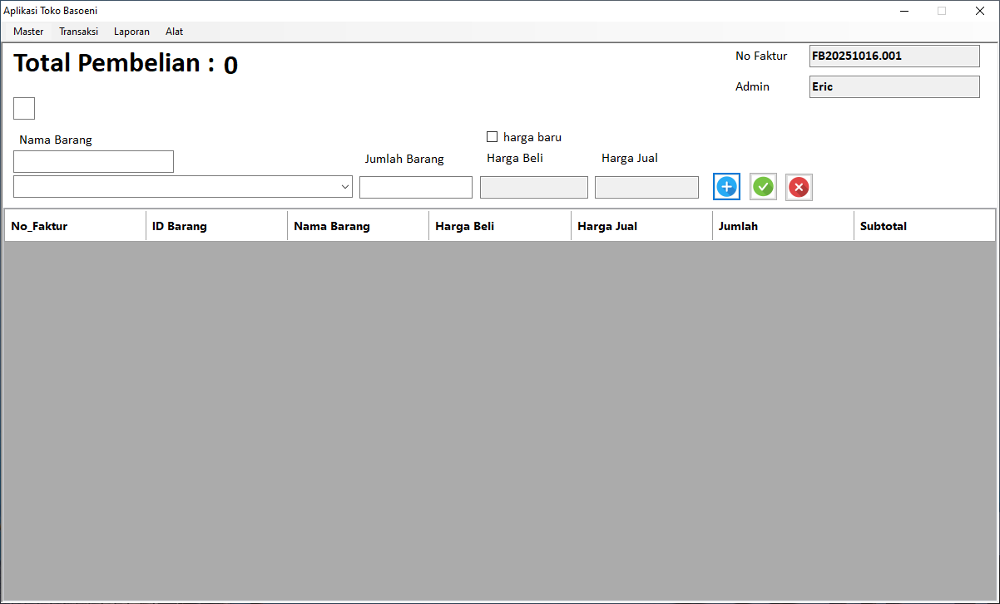
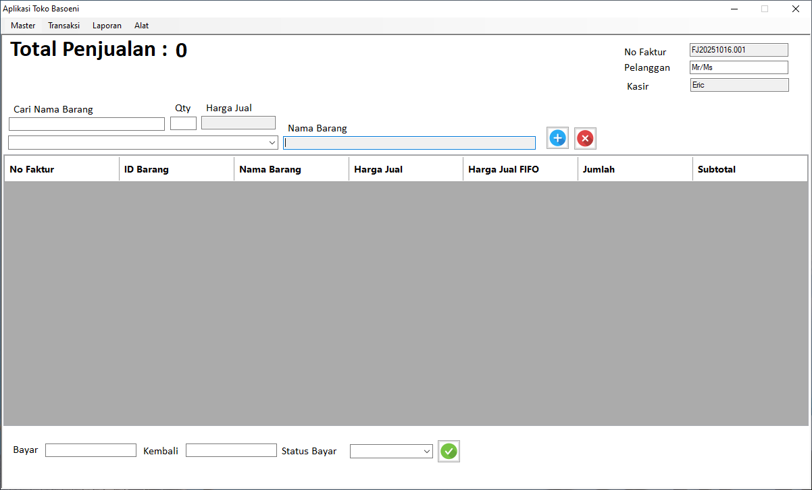
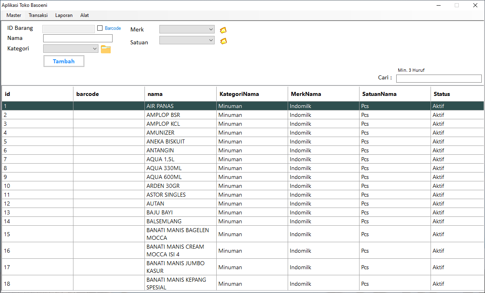
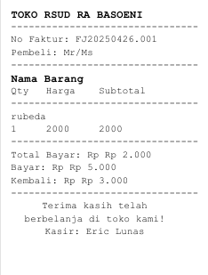

# 🏪 ToBas — Aplikasi Toko & Kelontong (FIFO)

**ToBas** adalah aplikasi manajemen toko kelontong berbasis **VB.NET + Microsoft Access** dengan fitur pengelolaan stok otomatis menggunakan metode **FIFO (First In First Out)**.  
Aplikasi ini dirancang untuk membantu toko kecil hingga menengah dalam mencatat transaksi pembelian, penjualan, retur, dan pembayaran dengan mudah.

---

## ✨ Fitur Utama

- 📦 **Manajemen Master Barang**
  - Tambah, ubah, hapus data barang
  - Stok total dan detail batch (FIFO)
  
- 🚚 **Transaksi Pembelian (Barang Masuk)**
  - Input supplier, harga beli, dan jumlah barang
  - Otomatis menambah batch stok baru

- 💸 **Transaksi Penjualan (Barang Keluar)**
  - Scan barcode produk / Ketik nama barang
  - Otomatis mengurangi stok berdasarkan urutan batch (FIFO)
  - Hitung total otomatis dan cetak nota

- 🔁 **Retur ke Supplier**
  - Retur barang berdasarkan batch tertentu
  - Stok otomatis berkurang dan tercatat di laporan retur

- 💳 **Status Pembayaran**
  - Tandai transaksi **Lunas / Belum Lunas**
  - Simpan riwayat pembayaran dan pelunasan bertahap
  - Fitur pencarian transaksi berdasarkan status pembayaran

- 📊 **Laporan dan Analisis**
  - Laporan pendapatan dan piutang
  - Laporan stok Barang (untuk penegcekan/stok opname)
  - Export ke **PDF**

---

## 🧮 FIFO (First In First Out)

Sistem FIFO memastikan bahwa barang yang pertama kali masuk akan dijual terlebih dahulu.  
Setiap kali transaksi penjualan terjadi, stok otomatis berkurang dari batch tertua, sehingga:
- Data stok tetap akurat
- Perputaran barang lebih terkontrol
- Menghindari penumpukan stok lama

---

## 📸 Tampilan Aplikasi

| Tampilan awal |
|:----------:|
|  |
| Transaksi Pembelian |
|  | 
| Transaksi Penjualan |
|  |
| Master Barang |
|  |
| Pengecekan Stok Barang |
|  |
| Contoh nota |
|  |

---

## ⚙️ Teknologi yang Digunakan

- 🧩 **VB.NET 2010**
- 💾 **Microsoft Access (.ACCDB)**
---

## 🚀 Demo Singkat

1. Tambahkan data barang ke *Master Barang*  
2. Input pembelian barang masuk  
3. Lakukan penjualan dengan scan barcode / Ketik nama barang  
4. Lihat stok otomatis berkurang sesuai FIFO  
5. Tampilkan laporan pendapatan dan piutang  
6. Export laporan stok ke PDF

---

## 📦 Rencana Pengembangan
- Integrasi database online (MySQL / Sheets)
- Dashboard berbasis web
- Sinkronisasi antar perangkat
- Modul kasir touchscreen

---

## 🧑‍💻 Pengembang

**ToBas — Toko & Kelontong App**  
Dikembangkan oleh: **RJ Prin & Desain**  
📍 Mojokerto, Indonesia  
💬 Contact: [WhatsApp](https://wa.me/6285853045583)

---
